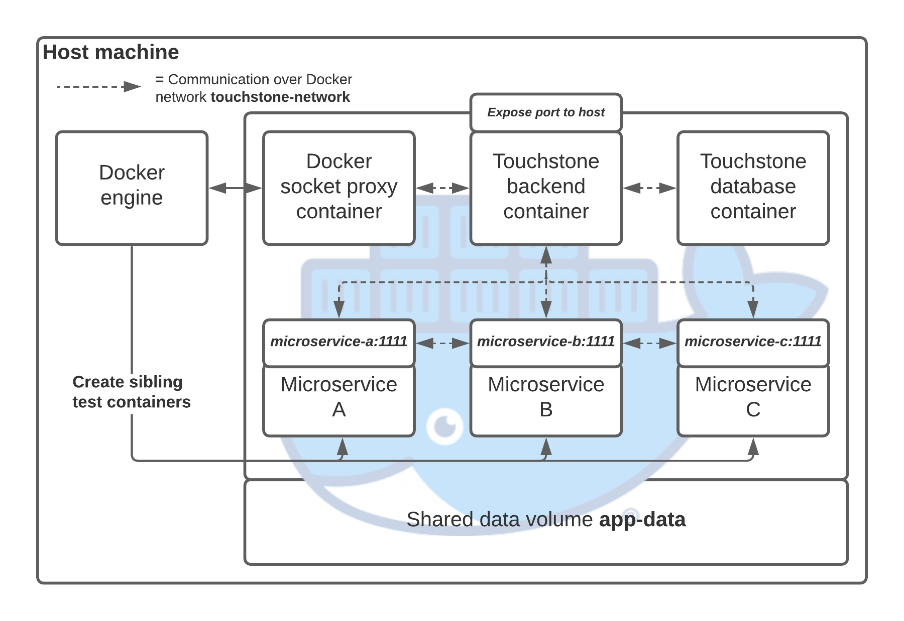

# Important note
You are on the legacy branch! This is Touchstone as it was on the day I submitted my BSc dissertation, which was written
on a strict deadline with very little sleep. As a result, much of the code doesn't meet the standards I would now expect 
(Unit tests? What are those?), there is very little documentation, and many useful features are missing. 

I wouldn't use this version to drive the testing of any critical applications. Why not take a look at the main branch 
instead?

### A comprehensive automated testing solution for microservices-based web applications

# Quick Start

- Install [Docker Desktop](https://www.docker.com/get-started) on your machine.
- Clone this repository and install the dependencies using Maven.
    - Optionally, modify touchstone/env/.env to configure the application to your liking. 
- Run start.bat and wait for the container to start up.
- Navigate to `localhost:8081/touchstone/swagger-ui/` and start testing!

You can also run Touchstone outside a Docker container, but you will still be required to have Docker running, the
Chrome WebDriver installed, and other mandatory environment variables passed in. Check out the
[existing .env file](touchstone/env/.env) as an example.

# Video Demonstration
[Watch the video](docs/Demonstration.m4v)

# Architecture (the technical bits)

## ... when running inside Docker


## ... when running on your machine


## Data Structures


### Test Schematic
A data structure containing all the information regarding the testing to be carried out for a given application, they 
could colloquially be described as test suites. The user can execute them to generate a test run.

### Test Case
A data structure containing one tests for one feature domain of the application, a test schematic can be assigned one or
more of these.

### Deployment Plan
A data structure containing a description of either an application or database microservice to be deployed before the 
test run. A test schematic can container one or more of these. One or more of these can be associated with a test 
schematic.

### Test Run
A data structure produced upon executing a test schematic, they contain the result collated after executing a test 
schematic. Test runs will follow a different internal workflow depending on whether they are QUEUED, PREPARING, or 
FINISHED.

## Components

### Touchstone API
Touchstone has a RESTful API serving as the primary point of interaction  between the application and the user. Despite 
being called the API, it is also responsible for driving the general flow of data within the application, including 
committing persistent data structures to the database and retrieving them when necessary. The primary technologies of
this component are Spring and MongoDB.

#### API v1 Endpoints
Touchstone will automatically generate Swagger documentation at `/touchstone/swagger-ui`, refer to it for a more
detailed listing of important data structures and possible responses you can get from each endpoint.

| Endpoint                                              | Purpose                                        | Data Required                      |
|-------------------------------------------------------|------------------------------------------------|------------------------------------|
| POST api/v1/register                                  | Register a new user                            | UserDTO                            |
| POST api/v1/login                                     | Log in as an existing user                     | UserDTO                            |
| GET api/v1/schematics/{id}                            | Get a test schematic by ID                     | id: String                         |
| POST api/v1/schematics                                | Create a new test schematic                    | TestSchematicDTO                   |
| PATCH api/v1/schematics/{id}                          | Update a test schematic by ID                  | TestSchematicDTO                   |
| PUT api/v1/schematics/{schematicId}/cases/{caseId}    | Add a test case to a test schematic by ID      | schematicId: String caseId: String |
| DELETE api/v1/schematics/{schematicId}/cases/{caseId] | Remove a test case from a test schematic by ID | schematicId: String caseId: String |
| GET api/v1/runner                                     | Get all test runs                              |                                    |
| GET api/v1/runner/{id}                                | Get a test run by ID                           | id: String                         |
| GET api/v1/runner/queue                               | Get all test runs currently in the queue       |                                    |
| POST api/v1/runner/queue                              | Add a new test run to the queue                | TestRunDTO                         |
| GET api/v1/cases/{id}                                 | Get a test case by ID                          | id: String                         |
| POST api/v1/cases                                     | Create a new test case                         | TestCaseDTO                        |
| PATCH api/v1/cases/{id}                               | Update a test case by ID                       | TestCaseDTO                        |
| POST api/v1/resources/dumps                           | Upload a new database dump                     | file: MultiPartFile (.bson.gz)     |
| GET api/v1/resources/screenshots/{name}               | Fetch a screenshot                             | name: String                       |
| GET api/v1/resources/report/{runId}                   | Generate and download a report for a run       | runId: String                      |

### Touchstone DSL
Touchstone has a human-readable scripting language allowing  the user to write behaviour-driven end-to-end test cases
against microservices-based web applications. It is responsible for driving automated interactions with the web browser 
and carrying out the validation of the user-facing components of web applications against the criteria provided by the
end user. The primary technologies of this component are Cucumber and the Chrome WebDriver.

The DSL is built on top of Cucumber, the simplicity of which facilitates the rapid development of new instructions sets 
and increased the usability of the application for a non-technical end user. In addition, the reporting functionality 
provided by Cucumber is used to provide the end user with comprehensive and informative results containing actionable 
feedback regarding the validity of their software.

#### Example Touchstone DSL Script
```
Feature: Touchstone GUI Login Page
	Scenario: The page should have a title
		Given I navigate to the web page &touchstone-test-gui-url&
		Then verify the text "Welcome to Touchstone" is on the page

	Scenario: I enter an invalid server address
		Given I navigate to the web page &touchstone-test-gui-url&
		When I type "&invalid-server-address&" into [xpath]"//*[@aria-label='Server Address']"
		And I type "&invalid-username&" into [xpath]"//*[@aria-label='Username']"
		And I type "&invalid-password&" into [xpath]"//*[@aria-label="Password"]"
		And I click on [xpath]"//*[@type='submit']"
		Then verify the text "An error occurred, please try again later" is on the page

	Scenario: I enter an invalid username and password
		Given I navigate to the web page &touchstone-test-gui-url&
		When I type "&touchstone-test-api-url&" into [xpath]"//*[@aria-label='Server Address']"
		And I type "&invalid-username&" into [xpath]"//*[@aria-label='Username']"
		And I type "&invalid-password&" into [xpath]"//*[@aria-label="Password"]"
		And I click on [xpath]"//*[@type='submit']"
		And wait for 0.5 seconds
		Then verify the text "A user with the username &invalid-username& could not be found" is on the page

	Scenario: I leave the username field blank
		Given I navigate to the web page &touchstone-test-gui-url&
		When I type "&touchstone-test-api-url&" into [xpath]"//*[@aria-label='Server Address']"
		And I type "&valid-password&" into [xpath]"//*[@aria-label="Password"]"
		And I click on [xpath]"//*[@type='submit']"
		Then verify the text "Value is required" is on the page

	Scenario: I leave the password field blank
		Given I navigate to the web page &touchstone-test-gui-url&
		When I type "&touchstone-test-api-url&" into [xpath]"//*[@aria-label='Server Address']"
		And I type "&valid-username&" into [xpath]"//*[@aria-label="Username"]"
		And I click on [xpath]"//*[@type='submit']"
		Then verify the text "Value is required" is on the page

	Scenario: I enter the correct credentials
		Given I navigate to the web page &touchstone-test-gui-url&
		When I type "&touchstone-test-api-url&" into [xpath]"//*[@aria-label='Server Address']"
		And I type "&valid-username&" into [xpath]"//*[@aria-label="Username"]"
		And I type "&valid-password&" into [xpath]"//*[@aria-label="Password"]"
		And I click on [xpath]"//*[@type='submit']"
		And wait for 0.5 seconds
		Then verify the element [xpath]"//*[contains(text(), 'Log Out')]" is on the page

	Scenario: I log out
		When I click on [xpath]"//*[contains(text(), 'Log Out')]"
		Then verify the text "Welcome to Touchstone" is on the page
```

### Touchstone Test Runner
The Touchstone test runner is responsible for orchestrating the lifecycle of isolated testing environments consisting of
multiple containers. When deployed, these containers effectively emulate a microservices-based system running in the 
cloud. The primary technologies of this component is Docker. The test runner is tightly integrated with the DSL, allowing 
the Chrome WebDriver to access and validate these emulated web applications deployed by the test runner as if they were 
on the World Wide Web.